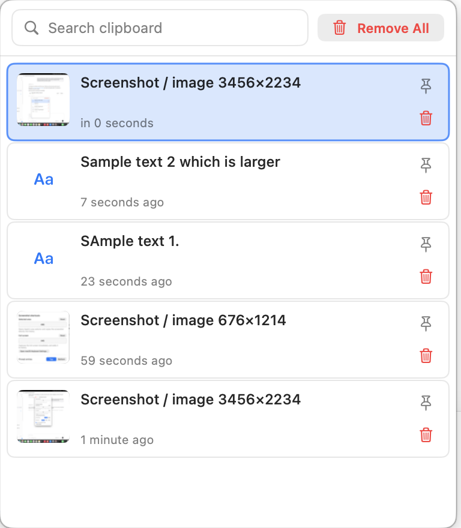
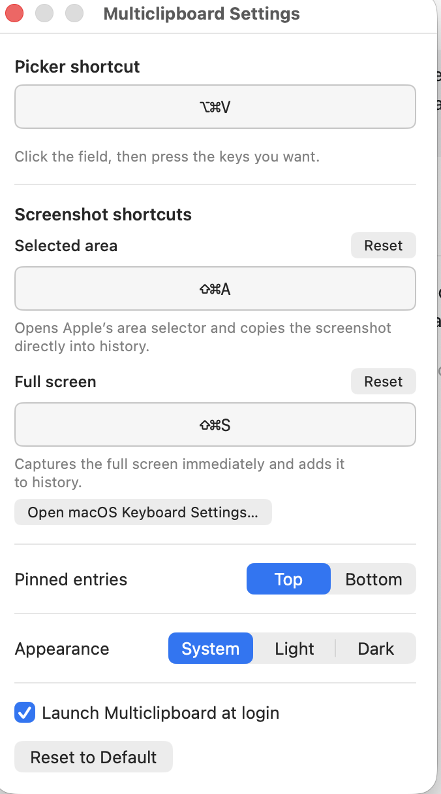

# Multiclipboard

Menu-bar clipboard manager for macOS.

## Screenshots

| Clipboard history | Settings |
| --- | --- |
|  |  |
| Search and paste saved text and images, pin entries, or remove clips. | Customize screenshot shortcuts, appearance, pin placement, and launch at login. |

## Requirements

- macOS 14+
- Xcode 15+ (or Swift 5.9+ command line tools)

## Build & run

For setup instructions, command-line and Xcode workflows, verification, and
troubleshooting, see [Running Multiclipboard](docs/RUNNING.md).

To run the app with a persistent Accessibility permission (needed for automatic
paste-back), build and launch its app bundle:

```bash
./Scripts/make_app.sh
open Multiclipboard.app
```

`swift run` is useful during development, but it launches a bare executable
whose Accessibility grant cannot be retained by macOS.

`make_app.sh` automatically uses an installed code-signing identity so the
grant survives rebuilds. On a machine without one, it falls back to ad-hoc
signing and prints a warning; macOS ties that grant to the current binary, so
it must be granted again after rebuilding. Set `MULTICLIP_SIGNING_IDENTITY` to
choose a specific identity.

The app launches as a menu-bar accessory (no Dock icon) with a status item.
It polls the system pasteboard every 500 ms and persists text, rich text,
images, and file URLs in a SwiftData history store.

## Picker panel

Press **⌘⌥V** from any app (or pick *Show Clipboard History* in the menu) to open
the floating picker. Keyboard shortcuts inside the panel:

| Key | Action |
| --- | --- |
| ↑ / ↓ | Move selection |
| ⏎ | Paste the selected clip into the previously frontmost app |
| ⌫ | Delete the selected clip (⌘⌫ while the search field has focus) |
| ⌘F | Focus the search field |
| Esc | Dismiss the panel |

The panel also closes as soon as it loses key focus. Pasting synthesizes a ⌘V
keystroke, which needs Accessibility permission
(System Settings → Privacy & Security → Accessibility). Without it the clip is
still copied to the pasteboard, it just isn't auto-pasted. If permission is
missing or has become stale, the app explains how to restore it and can open
the correct System Settings pane directly.

Entries are ordered newest-first within pinned and unpinned groups. Use the pin
button on a row to protect important entries, and choose whether pins appear at
the top or bottom in Settings. Rows and the context menu include Delete, while
the picker toolbar includes a confirmed Remove All action.

## Dependencies

- [HotKey](https://github.com/soffes/HotKey) — global keyboard shortcut registration, wired via SwiftPM.
